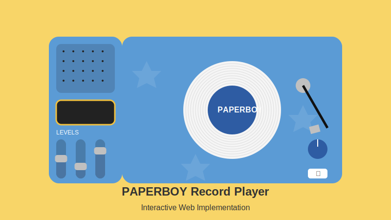

# PAPERBOY Record Player

An interactive web implementation of the PAPERBOY Record Player design, inspired by a Figma prototype.

## Features

- Interactive record player with spinning animation
- Draggable tonearm that moves into position when playing
- Functional audio controls (play, pause, next, previous)
- Volume control with visual knob rotation
- Equalizer sliders for bass, mid, and treble adjustment
- Responsive design for desktop and mobile devices
- Demo tracks using Creative Commons licensed audio

## How to Use

1. Clone this repository or download the files
2. Open `index.html` in your web browser
3. Click the play button to start the music and animation
4. Use the previous and next buttons to change tracks
5. Adjust the volume by dragging the blue knob
6. Modify the equalizer settings with the level sliders

## Technologies Used

- HTML5
- CSS3 (with animations and responsive design)
- JavaScript (ES6)
- Font Awesome icons
- SVG for the record character icon and favicon

## Design Credits

This implementation is based on the PAPERBOY Record Player Animation design, featuring a stylish blue and yellow color scheme with a branded vinyl record.

## License

The code in this repository is available under the MIT License. See the LICENSE file for more information.

Demo audio samples sourced from [Freesound.org](https://freesound.org/) under Creative Commons licenses.

## Live Demo

You can view a live demo of this project at: [https://megunair.github.io/paperboy-record-player/](https://megunair.github.io/paperboy-record-player/)

## GitHub Pages Setup

This project uses GitHub Actions to automatically deploy to GitHub Pages. The workflow is defined in `.github/workflows/deploy.yml` and will build and deploy the site whenever changes are pushed to the main branch.

---

Created based on Figma design analysis - PAPERBOY Record Player Animation

